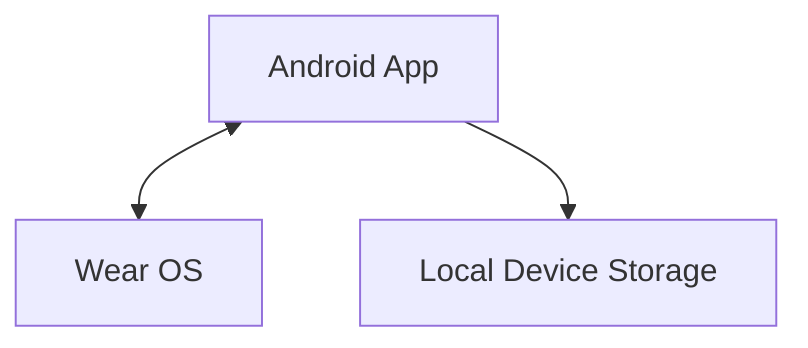

  

<h1 align="center">Racker Legal</h1>

Official public and legal resources for Racker.

  
  
  
  
  
  

## About Racker

Racker is a local-first Android + Wear OS workout tracker. Plan your workouts, record sets and reps, and track your progress across your phone and paired watch. No account is required.

## Public Pages

| Page | Link |
| --- | --- |
| Homepage | [Visit Racker](https://ilhanbuilds.github.io/Racker-Legal/) |
| Privacy Policy | [Read the policy](https://ilhanbuilds.github.io/Racker-Legal/privacy/) |

## Privacy by Design

- No Racker account required.
- Core workout data remains on the user's device.
- No developer-operated fitness-data backend.
- No advertising SDK or behavioral analytics/tracking SDK.
- Paired Android ↔ Wear OS communication uses Wearable Data Layer.
- Program sharing is user initiated through Racker links (`racker://`) or QR codes.

See the [Privacy Policy](https://ilhanbuilds.github.io/Racker-Legal/privacy/) for details.

## Repository Scope

This repository contains only the public website and privacy/legal documentation. Application source code is not included.

It does **not** contain Android app source code, Wear OS source code, signing keys or credentials, or private user data.

---

  <strong>Racker</strong> 
  Antrenmanına odaklan. Gelişimini takip et.  
  <a href="https://ilhanbuilds.github.io/Racker-Legal/">Website</a> · <a href="https://ilhanbuilds.github.io/Racker-Legal/privacy/">Privacy Policy</a>

